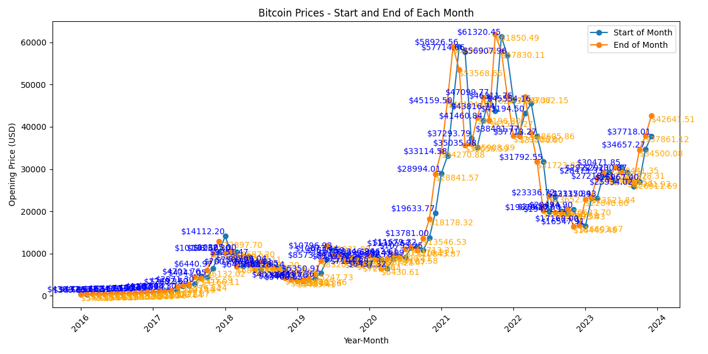

## Overview

This repository contains a Python script for analyzing and visualizing the monthly opening prices of Bitcoin (BTC) from January 2016 to the present.

### Prerequisites

- Python 3
  - yfinance
  - pandas
  - matplotlib

  
